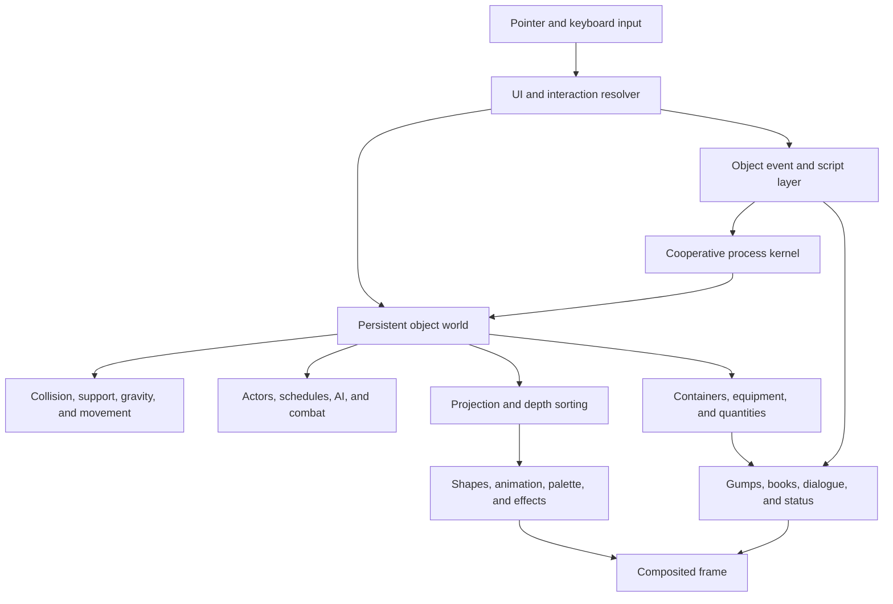
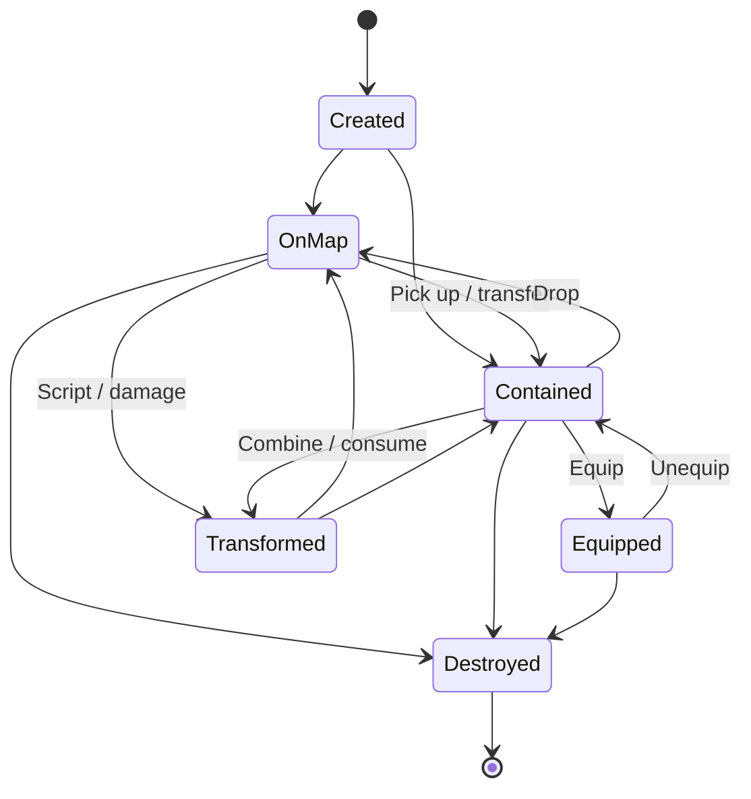

# Ultima VIII-Class World, Interaction, and UI Specification

**Version:** Draft 0.1  
**Status:** Capability baseline and acceptance specification  
**Date:** 27 July 2026  
**Reference basis:** *Ultima VIII: Pagan*, Pentagram, and ScummVM's Ultima VIII engine

## Checkpoint definition

> A continuous, depth-sorted 2D world in which nearly every visible thing is a
> persistent object that can participate in movement, collision, containment,
> physics, scripting, combat, and direct manipulation.

This specification defines the graphics, world simulation, interaction,
gameplay, and UI capabilities required to reproduce the class of experience
demonstrated by *Ultima VIII: Pagan*. It describes observable mechanics and
system contracts. It does not prescribe Origin's proprietary implementation,
assets, story, or content.

The checkpoint is not primarily a measure of image quality. It is a measure of
**object coherence**: a sword on the ground, inside a chest, equipped by the
player, carried by an NPC, or moving through the air remains the same kind of
persistent simulated object.

---

## 1. Purpose and scope

This specification can be used for:

- engine planning;
- vertical-slice definition;
- architecture review;
- feature acceptance;
- interaction and content-tool planning;
- comparison of an implementation against an Ultima VIII-class baseline.

Graphics and gameplay are treated as one system:

- the rendered scene presents authoritative world state;
- pointer selection agrees with the visible scene;
- player actions operate on persistent objects;
- scripts use the same world services as native engine behavior;
- save/load preserves the consequences.

### 1.1 Normative language

- **MUST** identifies a capability required to claim the checkpoint.
- **SHOULD** identifies a strongly recommended capability whose omission needs
  an explicit rationale.
- **MAY** identifies an optional enhancement that does not determine checkpoint
  completion.

### 1.2 In scope

- Oblique isometric-style projection.
- Pixel-authored sprites, animation, palettes, effects, and camera behavior.
- Stable depth sorting and sprite-aware selection.
- Persistent maps, objects, actors, containers, and triggers.
- Collision volumes, supporting surfaces, gravity, hazards, and placement.
- Direct manipulation of world and inventory objects.
- Avatar locomotion, real-time combat, AI, dialogue, and readable objects.
- Event-driven object scripts and cooperative processes.
- Gump-style UI, targeting, feedback, save/load, and system screens.
- A playable vertical slice proving the integrated checkpoint.

### 1.3 Out of scope

- Distribution of copyrighted Ultima VIII assets or data.
- Networked multiplayer.
- Procedural world generation.
- General-purpose rigid-body physics.
- Physically based rendering or modern 3D lighting.
- Reproduction of Ultima VIII's plot, dialogue, characters, or world.
- Compatibility with Ultima VIII data unless separately required.

---

## 2. Product principles

### 2.1 Object coherence

An object retains its identity, type, state, and relevant history as it moves
between the map, containers, equipment, actors, and scripted sequences.

### 2.2 Shared rules

The player, NPCs, movable items, projectiles, and scripted movement use the same
collision, support, placement, and persistence services.

### 2.3 Visual truth

Sprite position, elevation, animation, occlusion, and UI contents are derived
from authoritative world state. Decorative approximations do not substitute
for simulated state.

### 2.4 Systemic interaction

World verbs act on object capabilities and event handlers rather than isolated
scene hotspots.

### 2.5 Deterministic simulation

Stable, reproducible bounding-volume and process behavior is preferred over
unrestricted physics. The same input and state should produce the same result.

### 2.6 Data-driven content

Quests, dialogue, triggers, mechanisms, and object-specific behavior are
authored through data and scripts rather than compiled into individual scenes.

---

## 3. System architecture

The reference architecture contains six cooperating layers:

1. **Input and interaction**
   - pointer and keyboard input;
   - UI focus and modal routing;
   - sprite-aware hit testing;
   - drag state;
   - verb inference;
   - reach and target validation.

2. **Persistent world**
   - maps and regions;
   - stable object identities;
   - positions and physical dimensions;
   - containers and equipment;
   - trigger objects;
   - global and local state.

3. **Simulation**
   - movement and collision;
   - support and gravity;
   - object placement;
   - hazards;
   - projectiles;
   - object creation and destruction.

4. **Actors and gameplay**
   - Avatar control;
   - actor animation;
   - schedules and AI;
   - combat and spells;
   - dialogue;
   - inventory and equipment.

5. **Script and process**
   - object events;
   - cooperative processes;
   - waits and notifications;
   - engine intrinsics;
   - quest flags;
   - cutscene sequencing.

6. **Presentation**
   - projection and depth sorting;
   - shapes and animation;
   - palette effects;
   - camera and audio;
   - gumps, text, books, and status feedback.



### 3.1 Authoritative state

The persistent world is authoritative. Rendering, UI, pathfinding, scripts, and
audio consume or request changes to world state; they do not maintain
independent competing copies of object state.

### 3.2 Update flow

A normal frame or simulation tick follows this sequence:

1. Collect and normalize input.
2. Route input through modal UI, open gumps, drag state, and world interaction.
3. Advance cooperative processes and scripts.
4. Advance actor behavior and movement.
5. Resolve collision, support, gravity, projectiles, hazards, and object
   lifecycle changes.
6. Commit authoritative state changes.
7. Update camera and presentation state.
8. Query visible objects, establish render order, and draw the world.
9. Draw effects, cursor, gumps, dialogue, and system overlays.
10. Mix audio and present the frame.

---

## 4. Graphics and presentation

### 4.1 Logical viewport and scaling

- **GFX-001:** The engine MUST render through a fixed logical coordinate system
  suitable for pixel-authored content. A 320 x 200 logical canvas is the
  historical baseline.
- **GFX-002:** The presentation layer MUST support integer or nearest-neighbor
  scaling without blurring pixel artwork.
- **GFX-003:** Physical-window scaling MUST preserve the logical coordinate
  transform used for UI and world hit testing.
- **GFX-004:** Letterboxing or pillarboxing MUST not alter gameplay coordinates.
- **GFX-005:** Fullscreen and windowed presentation MUST produce equivalent
  selection and placement behavior.

### 4.2 World coordinates and projection

World positions contain two horizontal coordinates and one elevation
coordinate:

```text
position = { x, y, z }
```

The renderer converts this to a screen position using a deterministic oblique
projection. The exact scale may vary, but the transform must be shared by
rendering, selection, camera, and placement previews.

- **GFX-010:** Every map object MUST have an authoritative `x`, `y`, and `z`
  position or a position inherited from its parent container.
- **GFX-011:** The renderer MUST project all visible world objects through one
  consistent world-to-screen transform.
- **GFX-012:** Elevation MUST visibly affect screen position.
- **GFX-013:** Projection and inverse selection calculations MUST use the same
  coordinate conventions.
- **GFX-014:** Interior, exterior, and elevated areas MUST not require separate
  rendering rules.

### 4.3 Camera

- **GFX-020:** The camera MUST scroll continuously through the logical world.
- **GFX-021:** The camera MUST be able to follow the Avatar.
- **GFX-022:** Scripts MUST be able to focus, move, or temporarily detach the
  camera.
- **GFX-023:** Camera behavior MUST remain synchronized with jumps, falls,
  moving supports, teleports, and cutscenes.
- **GFX-024:** Returning camera control to the player MUST not introduce a
  discontinuity or invalid pointer transform.

### 4.4 Shape resources

A **shape** is a sprite resource with one or more frames and associated
metadata. A shape frame requires:

- pixel data;
- transparency;
- width and height;
- an origin or anchor offset;
- an optional frame duration;
- optional selection and physical metadata;
- optional animation or direction classification.

- **GFX-030:** A shape MUST support multiple frames.
- **GFX-031:** Each frame MUST support its own dimensions and origin offsets.
- **GFX-032:** Transparent pixels MUST not overwrite the background.
- **GFX-033:** Sprite-aware hit testing SHOULD ignore transparent pixels.
- **GFX-034:** Actors MUST support directional animation sequences.
- **GFX-035:** World objects SHOULD support frame-driven state such as closed,
  opening, open, damaged, extinguished, or transformed.
- **GFX-036:** Transient sprites MUST support fire, impact, smoke, projectiles,
  magic, selection, and similar effects.

### 4.5 Palette and color behavior

- **GFX-040:** The graphics layer MUST support indexed-color artwork or an
  equivalent palette-controlled pipeline.
- **GFX-041:** The engine MUST support palette fades.
- **GFX-042:** The engine MUST support color transformations such as flashes,
  tinting, inversion, or damage effects.
- **GFX-043:** Palette cycling SHOULD be available for water, fire, magic, or
  environmental animation.
- **GFX-044:** Palette transitions MUST not corrupt UI colors or shape
  transparency.

### 4.6 Depth sorting and occlusion

Correct scene ordering is a defining technical requirement. Sorting only by a
sprite's anchor point is insufficient because objects occupy volumes, overlap,
and can stand on other objects.

Each renderable world object exposes:

```text
sort volume =
  horizontal footprint {min_x, min_y, max_x, max_y}
  vertical interval    {min_z, max_z}
```

- **GFX-050:** The renderer MUST establish front/behind relations from object
  position, footprint, elevation, and overlap.
- **GFX-051:** Render order MUST remain stable when relations are ambiguous.
- **GFX-052:** Ambiguous ordering MUST not flicker from frame to frame.
- **GFX-053:** The system MUST correctly handle:
  - actors behind walls;
  - items on tables;
  - stacked objects;
  - bridges and elevated platforms;
  - partially overlapping sprites;
  - objects moving between elevation levels.
- **GFX-054:** Content tools SHOULD identify cyclic or ambiguous sort relations.
- **GFX-055:** Authoring data MAY provide explicit ordering overrides for
  exceptional shapes.

### 4.7 Selection and visual order

- **GFX-060:** Pointer selection MUST agree with final visible ordering.
- **GFX-061:** An opaque foreground object MUST normally prevent selection of
  an object behind it.
- **GFX-062:** Transparent sprite regions SHOULD allow selection to continue to
  objects behind them.
- **GFX-063:** Deliberate object cycling or accessibility selection MAY expose
  occluded objects without changing normal hit-testing rules.

### 4.8 Compositing order

The default compositing order is:

1. cleared logical surface;
2. world terrain and fixed objects;
3. dynamic objects and actors in resolved depth order;
4. transient world effects;
5. world-relative text or markers;
6. cursor and targeting feedback;
7. non-modal gumps;
8. modal gumps and system overlays;
9. transition or cinematic effects.

---

## 5. Persistent world model

### 5.1 Base object schema

Every placed or contained entity has an authoritative record equivalent to:

```text
WorldObject
  stable_id
  type_id
  shape_id
  frame_id

  map_id
  position {x, y, z}
  footprint {width, depth}
  height

  flags {
    solid
    fixed
    movable
    usable
    visible
    damaging
    container
    actor
    trigger
    ...
  }

  quality
  quantity
  condition

  parent_container_id
  owner_actor_id

  script_class
  local_script_state
  runtime_process_references
```

- **WRLD-001:** Object identity MUST survive transfer between the world,
  containers, actors, and equipment.
- **WRLD-002:** Map placement and container membership MUST be mutually
  exclusive authoritative locations.
- **WRLD-003:** Objects MUST support data-defined capabilities and flags.
- **WRLD-004:** Creation, destruction, transformation, movement, and ownership
  changes MUST be persistable.
- **WRLD-005:** Runtime references MUST fail safely if their target object is
  destroyed.
- **WRLD-006:** Content MUST not rely on renderer-owned object identities.

### 5.2 Object families

The base model supports these families:

- fixed scenery;
- movable props;
- stackable items;
- containers;
- equipment;
- actors;
- weapons and armor;
- projectiles;
- readable objects;
- doors and mechanisms;
- hazards;
- trigger objects;
- transient effect objects;
- corpses and remains.

Object families may share one implementation with different data and scripts.

### 5.3 Object lifecycle

An object moves through explicit lifecycle states:



Lifecycle transitions must be atomic. An object cannot simultaneously exist on
a map and inside a container.

### 5.4 Spatial organization

- **WRLD-010:** The engine MUST provide spatial queries by map region, point,
  volume, object identity, and capability.
- **WRLD-011:** Static and dynamic objects MUST participate in one visibility
  and collision query model.
- **WRLD-012:** The world SHOULD index or activate regions so distant objects do
  not require full per-frame processing.
- **WRLD-013:** Region activation MUST preserve object identity and persistent
  state.
- **WRLD-014:** Interiors, exteriors, disconnected maps, and elevation changes
  MUST use a consistent object model.

### 5.5 Collision

Collision uses object volumes rather than only blocked floor cells.

- **SIM-001:** A solid object's collision representation MUST include horizontal
  footprint and vertical extent.
- **SIM-002:** Movement MUST identify the specific blocking object.
- **SIM-003:** Collision queries MUST support point, volume, movement, and
  placement tests.
- **SIM-004:** Actors and movable objects MUST use compatible collision rules.
- **SIM-005:** Object state changes such as opening a door MUST update collision
  and pathfinding coherently.
- **SIM-006:** Collision resolution MUST not leave an object embedded in an
  invalid volume.

### 5.6 Supporting surfaces

An object can support another object if its metadata and current state allow it.

- **SIM-010:** Movement MUST determine the highest valid supporting surface.
- **SIM-011:** Actors and movable objects MUST know which map surface or object
  currently supports them.
- **SIM-012:** Furniture, platforms, terrain, and large objects MAY provide
  support.
- **SIM-013:** A supporting object that moves MUST carry supported objects
  according to deterministic rules.
- **SIM-014:** Removing or disabling support MUST cause affected objects to
  enter a falling state.

### 5.7 Gravity and falling

- **SIM-020:** Actors and designated movable objects MUST fall when unsupported.
- **SIM-021:** Falling MUST stop at the highest valid support encountered.
- **SIM-022:** Falling MUST be interruptible by teleportation, destruction, or
  scripted state changes.
- **SIM-023:** Falls MAY apply damage based on distance, speed, surface, or
  content rules.
- **SIM-024:** Hazard surfaces MAY apply damage, death, status effects,
  teleportation, or scripted events.

### 5.8 Placement

Dropping or moving an object validates:

- destination map or container;
- target position;
- bounds;
- supporting surface;
- collision and overlap;
- actor reach;
- object movability;
- weight or capacity;
- allowed-content rules;
- script restrictions.

- **SIM-030:** A valid placement MUST commit the complete transfer.
- **SIM-031:** An invalid placement MUST leave the object at a valid source or
  fallback location.
- **SIM-032:** Failed placement MUST provide feedback.
- **SIM-033:** Placement MUST invalidate affected spatial, render-order, and
  pathfinding caches.

### 5.9 Containers

- **OBJ-001:** Containers MUST own collections of object identities.
- **OBJ-002:** Nested containers MUST be supported.
- **OBJ-003:** Container cycles MUST be prevented.
- **OBJ-004:** A container MAY define capacity, weight, volume, type, or
  placement restrictions.
- **OBJ-005:** Opening a container MUST present its actual authoritative
  contents.
- **OBJ-006:** Destroying a container MUST apply an explicit content policy:
  spill, transfer, destroy, or script.

### 5.10 Quantities and stacking

- **OBJ-010:** Stackable items MUST have an explicit quantity.
- **OBJ-011:** Compatible stacks MUST support merge.
- **OBJ-012:** A stack MUST support partial transfer and split.
- **OBJ-013:** Stack compatibility MUST be defined by data or script, not only
  visual shape.
- **OBJ-014:** Consuming from a stack MUST destroy the object only when quantity
  reaches zero.

### 5.11 Equipment

- **OBJ-020:** Equipment slots MUST reference ordinary inventory objects.
- **OBJ-021:** Equipping MUST validate slot, actor, and item restrictions.
- **OBJ-022:** Equipment effects MUST be derived from the equipped object's
  authoritative data.
- **OBJ-023:** Unequipping MUST transfer the object to a valid destination.
- **OBJ-024:** Actor sprites MAY change based on equipped items or overlays.

### 5.12 Triggers

Invisible or visible trigger objects connect location, proximity, time, and
world events to scripts. Ultima terminology commonly calls these **eggs**.

- **TRG-001:** Triggers MUST support activation by entry, exit, proximity, use,
  collision, timer, or explicit script call.
- **TRG-002:** Trigger behavior MUST be scriptable.
- **TRG-003:** Trigger activation state MUST be persistent when required.
- **TRG-004:** Required trigger families include:
  - teleport;
  - monster or object spawn;
  - conversation;
  - cutscene;
  - hazard;
  - quest;
  - map transition.

---

## 6. Interaction grammar

The player manipulates the world model rather than activating generic hotspots.

### 6.1 Core verbs

| Verb | Input intent | World operation | Persistent result |
|---|---|---|---|
| Move | Point or directional input | Move or path toward a point while respecting collision and support | Position and animation |
| Look | Inspect object | Resolve a description or scripted response | Normally none |
| Use | Activate object | Invoke a default capability or object event | Object or script state |
| Talk | Activate actor | Start dialogue if availability and reach rules pass | Dialogue and quest flags |
| Pick up | Drag movable object | Detach from map or source container and begin a transfer | Committed on drop |
| Drop | Release over world or container | Validate destination and place or transfer | Position or membership |
| Equip | Drop into equipment slot | Validate slot and actor restrictions | Equipment and derived stats |
| Combine | Drop onto compatible object | Invoke merge or source/target behavior | Quantity or transformed objects |
| Split | Choose a partial quantity | Create a partial stack with a new identity | Two valid quantities |
| Use on target | Select source and target | Invoke source/target event contract | Effect-dependent |
| Push | Directional object action | Move an object while checking collision and support | Position |
| Throw | Directed release | Start object motion and impact processing | Position, damage, or destruction |
| Attack | Combat input | Resolve timing, range, hit, damage, and effect | Health, status, objects |
| Cast | Spell and target input | Invoke actor, object, position, area, or self effect | Effect-dependent |
| Read | Activate readable object | Open book, sign, plaque, or scroll UI | Optional read/quest state |

### 6.2 Interaction-resolution pipeline

1. Determine whether the input belongs to a modal UI, an open gump, a drag
   operation, or the world.
2. Resolve the topmost eligible object from visible sprite pixels and
   world-space selection metadata.
3. Infer the requested verb from input mode, click count, held object, combat
   state, and target type.
4. Validate visibility, reach, ownership, capacity, collision, support, and
   script-defined restrictions.
5. Dispatch the event to the object script.
6. Use default engine behavior only when the script does not override it.
7. Commit the world mutation atomically.
8. Start any required asynchronous process.
9. Provide visual, textual, and audio feedback.
10. Mark affected state for persistence and invalidate dependent caches.

### 6.3 Hit testing

- **INT-001:** Hit testing MUST start from final visible render order.
- **INT-002:** Transparent pixels SHOULD be excluded from ordinary selection.
- **INT-003:** UI hit testing MUST take precedence over the world when a gump
  covers the same pixels.
- **INT-004:** Modal UI MUST prevent input from leaking into underlying world
  interactions.
- **INT-005:** Selection MUST return an object identity, not only a shape or
  screen coordinate.

### 6.4 Reach and validity

- **INT-010:** Object scripts and default verbs MUST be able to request a reach
  check.
- **INT-011:** Reach SHOULD account for distance, elevation, blocking objects,
  and actor state.
- **INT-012:** Remote actions MAY bypass reach when explicitly defined by a
  spell, tool, or script.
- **INT-013:** A failed reach or validity check MUST not partially mutate state.

### 6.5 Drag and drop

- **INT-020:** Dragging MUST retain the identity and quantity of the selected
  object.
- **INT-021:** The object MUST have one authoritative source throughout the
  drag transaction.
- **INT-022:** The pointer MUST display the dragged object or an unambiguous
  proxy.
- **INT-023:** World, container, and equipment targets MUST share one transfer
  contract.
- **INT-024:** A failed drop MUST restore or retain a valid source location.
- **INT-025:** Drag cancellation MUST be safe at any time.
- **INT-026:** Dragging a partial stack MUST explicitly choose or infer the
  transferred quantity.

### 6.6 Default and scripted behavior

An interaction may be handled by:

1. a source-object event;
2. a target-object event;
3. a source-target pair rule;
4. a generic capability;
5. a default failure response.

Scripts may veto, replace, or extend default behavior, but they must use the
same transactional object-transfer and persistence services as engine-native
actions.

---

## 7. Avatar locomotion and physicality

### 7.1 Required animation states

- idle;
- turn;
- walk;
- run;
- jump;
- fall;
- land;
- melee attack;
- ranged or casting action;
- hit reaction;
- death;
- optional use, crouch, climb, or special action.

### 7.2 Movement requirements

- **MOVE-001:** Avatar movement MUST be continuous within the logical world
  coordinate system.
- **MOVE-002:** Movement MUST support multiple directions appropriate to the
  visual perspective.
- **MOVE-003:** Walk and run MUST have distinct speeds and animations.
- **MOVE-004:** Animation and displacement timing MUST remain synchronized.
- **MOVE-005:** The movement solver MUST account for solid objects, actor
  occupancy, support elevation, ledges, and moving platforms.
- **MOVE-006:** Blocked movement MUST fail safely without embedding the Avatar
  in geometry.
- **MOVE-007:** Direct movement and path-assisted movement MUST produce
  equivalent collision results.

### 7.3 Jumping and falling

- **MOVE-010:** Jumping MUST produce a deterministic arc or staged movement.
- **MOVE-011:** A jumping Avatar MUST transition to falling when support is
  absent.
- **MOVE-012:** Landing MUST resolve a valid support and animation state.
- **MOVE-013:** Jumping MUST not bypass solid volumes unless explicitly allowed.
- **MOVE-014:** Falls MAY cause damage or death.
- **MOVE-015:** Camera tracking MUST remain coherent throughout vertical motion.

### 7.4 Moving supports

- **MOVE-020:** The Avatar MUST be able to stand on a moving platform.
- **MOVE-021:** A supported Avatar MUST inherit the platform's motion according
  to deterministic rules.
- **MOVE-022:** Jumping or walking off a moving platform MUST cleanly end the
  support relationship.
- **MOVE-023:** Save/load MUST restore platform and supported-object state
  coherently.

---

## 8. Actors, schedules, and AI

### 8.1 Actor state

An actor extends the world-object model with:

```text
Actor
  WorldObject fields

  faction and disposition
  life state
  health and attributes
  resistances and status effects

  facing
  current animation
  movement process
  current target

  inventory
  equipment

  behavior state
  schedule state
  dialogue state
```

### 8.2 Behavior states

The system must be able to express:

- idle;
- loiter;
- patrol;
- scheduled movement;
- converse;
- investigate;
- pursue;
- attack;
- flee;
- surrender;
- scripted movement;
- incapacitation;
- death;
- resurrection where content permits.

### 8.3 AI requirements

- **AI-001:** Actors MUST use the same placement, collision, support, gravity,
  and hazard rules as the Avatar.
- **AI-002:** Pathfinding MUST account for currently solid world objects.
- **AI-003:** Pathfinding MUST account for the movement capabilities and
  dimensions of the actor.
- **AI-004:** Actor occupancy SHOULD influence local movement.
- **AI-005:** Scripts MUST be able to start, suspend, replace, and observe actor
  behavior.
- **AI-006:** Distant actors MAY use reduced-frequency or abstract updates.
- **AI-007:** Reactivating a distant actor MUST produce a coherent position and
  schedule state.

### 8.4 Schedules

- **AI-010:** An actor MAY have time-based or story-based activities.
- **AI-011:** A schedule entry MUST identify an activity, destination, and
  activation condition.
- **AI-012:** Scripted story behavior MUST be able to override a normal
  schedule.
- **AI-013:** Schedule state MUST survive save/load.
- **AI-014:** A failed path to a scheduled destination MUST produce a defined
  fallback rather than a permanently blocked process.

---

## 9. Combat and spells

### 9.1 Real-time combat

- **CMB-001:** Combat MUST occur in the normal world simulation.
- **CMB-002:** Combat MUST not switch to a separate abstract map or rule set.
- **CMB-003:** Attacks MUST use animation-timed action or hit windows.
- **CMB-004:** Combat state MUST coexist with collision, gravity, hazards,
  object interaction, scripts, and camera behavior.

### 9.2 Melee attacks

A melee attack resolves:

1. attacker state;
2. weapon or natural attack;
3. target validity;
4. range;
5. facing or target relation;
6. attack animation;
7. hit timing;
8. hit or miss;
9. damage;
10. armor and resistance;
11. reaction, status, death, or scripted effect.

- **CMB-010:** Equipped weapons MUST be ordinary persistent objects.
- **CMB-011:** Weapon data MUST define damage and relevant attack properties.
- **CMB-012:** Armor MUST derive its effect from equipped objects and actor
  state.
- **CMB-013:** Attacks MUST be interruptible where required by death, movement,
  stun, or script.

### 9.3 Projectiles

- **CMB-020:** The engine MUST support tracked projectile objects or processes.
- **CMB-021:** Projectiles MUST have position, direction or target, speed, and
  collision behavior.
- **CMB-022:** Projectile impact MUST be able to damage actors or designated
  world objects.
- **CMB-023:** A projectile MUST be able to trigger a script or spawn an effect.
- **CMB-024:** Projectile destruction, recovery, or embedding behavior MUST be
  explicit.

### 9.4 Damage and death

- **CMB-030:** Actors and designated world objects MUST be damageable.
- **CMB-031:** Damage MUST identify source, type, amount, and target.
- **CMB-032:** Damage MAY apply status effects, knockback, transformation, or
  scripts.
- **CMB-033:** Death MUST terminate or replace incompatible actor processes.
- **CMB-034:** Death MUST produce the correct corpse, remains, destruction,
  loot, or resurrection state.
- **CMB-035:** Death results MUST be persistent.

### 9.5 Spells

Spells may target:

- the caster;
- an actor;
- a world object;
- a map position;
- an area;
- a direction;
- every eligible object in a query.

- **CMB-040:** Spells MUST be able to call bounded world, actor, UI, audio, and
  effect services.
- **CMB-041:** Spell costs, reagents, cooldowns, and requirements MUST be
  data-driven or scripted.
- **CMB-042:** Spell effects MUST use ordinary object and persistence services.
- **CMB-043:** Targeting MUST identify legal and illegal targets before commit
  where practical.

---

## 10. Script and process model

### 10.1 Object events

Object and actor types may bind handlers for:

- `onLook`;
- `onUse`;
- `onTalk`;
- `onEnter`;
- `onLeave`;
- `onCollide`;
- `onHit`;
- `onDamage`;
- `onDie`;
- `onCombine`;
- `onEquip`;
- `onUnequip`;
- `onTimer`;
- `onCreate`;
- `onDestroy`;
- custom events.

- **SCR-001:** Event dispatch MUST identify the source, target, acting actor,
  and relevant context.
- **SCR-002:** Scripts MUST have access to global flags and object-local state.
- **SCR-003:** Scripts MUST support lists or equivalent collections.
- **SCR-004:** Scripts MUST have deterministic random services.
- **SCR-005:** Content scripts MUST not directly mutate renderer-only state.

### 10.2 Engine intrinsics

The script layer requires a bounded API for:

- object creation and destruction;
- object queries;
- map position and movement;
- container transfer;
- quantities and equipment;
- actor animation and behavior;
- health, damage, and status;
- dialogue and readable text;
- gumps and targeting;
- sound and music;
- camera and cutscenes;
- time and delays;
- global and local flags;
- save-safe process coordination.

- **SCR-010:** Intrinsics MUST validate object identities and arguments.
- **SCR-011:** Intrinsics that mutate world state MUST use authoritative world
  services.
- **SCR-012:** An intrinsic failure MUST not leave a partial transfer or invalid
  object state.
- **SCR-013:** Intrinsic availability SHOULD be versioned.

### 10.3 Cooperative processes

Long-running actions use coroutines or cooperative processes rather than
blocking the main loop. A process may wait for:

- elapsed time;
- animation completion;
- actor movement;
- speech completion;
- UI dismissal;
- another process;
- a scripted condition;
- a map or camera transition.

- **PROC-001:** The kernel MUST assign runtime identities to active processes.
- **PROC-002:** A process MUST support start, yield, wait, terminate, and
  completion notification.
- **PROC-003:** Processes MUST declare or expose their owning object where
  relevant.
- **PROC-004:** Destroying an owning object MUST apply a defined process policy.
- **PROC-005:** Mutually incompatible actor processes MUST be replaceable or
  cancellable through explicit policy.
- **PROC-006:** Save/load MUST serialize active processes or reconstruct them at
  defined safe points.

### 10.4 Example scripted interaction

```text
onUse(lockedDoor):
  if player.has(key):
    playAnimation(door, OPENING)
    waitUntilAnimationEnds(door)
    door.solid = false
    setFlag("door_open", true)
  else:
    actorSay(player, "It is locked.")
```

The example changes animation, collision, story state, and feedback through
shared services. The script does not directly alter render lists.

### 10.5 Dialogue

- **SCR-020:** Dialogue MUST support actor speech and player choices.
- **SCR-021:** Choice availability MUST be conditionable on flags, objects,
  actor state, or prior dialogue.
- **SCR-022:** Dialogue choices MUST be able to mutate world, actor, inventory,
  and quest state.
- **SCR-023:** Dialogue MUST coexist with bark text and scripted animation.
- **SCR-024:** Cancellation, actor death, map transition, and save/load behavior
  MUST be defined.

### 10.6 Cutscenes

- **SCR-030:** A cutscene MUST be expressible as cooperating camera, actor,
  animation, speech, audio, UI, and timing processes.
- **SCR-031:** Input suppression MUST be explicit and reversible.
- **SCR-032:** Cutscene completion or cancellation MUST restore a valid camera,
  input, actor, and UI state.
- **SCR-033:** A cutscene MUST not require a second non-persistent copy of the
  world.

---

## 11. User-interface specification

### 11.1 UI model

The interface uses layered **gumps**: movable, non-modal, or modal surfaces
drawn over the game world.

- **UI-001:** Gumps MUST participate in explicit z-order.
- **UI-002:** Gumps MUST participate in focus and hit testing.
- **UI-003:** Gumps MUST route drag operations.
- **UI-004:** Gumps MUST support explicit dismissal.
- **UI-005:** Modal gumps MUST gate underlying input predictably.
- **UI-006:** Opening or moving a gump MUST not mutate world state except
  through an explicit action.
- **UI-007:** Gump state that affects gameplay MUST be save-safe or
  reconstructable.

### 11.2 UI input priority

Input is resolved in this order:

1. system-level confirmation or fatal message;
2. active modal gump;
3. active targeting or quantity-selection mode;
4. active drag operation;
5. focused or topmost non-modal gump;
6. game world;
7. global shortcuts.

Global shortcuts must not bypass a modal action unless deliberately allowed.

### 11.3 Required UI surfaces

| Surface | Required behavior |
|---|---|
| Desktop/game map | World composition, cursor, targeting, drag surface, contextual feedback |
| Container | Show actual contents; drag in/out; open nested containers |
| Inventory | Show carried objects and provide transfer targets |
| Paper doll/equipment | Show equipment slots and accept validated equip/unequip operations |
| Status | Show health and important combat or condition state |
| Dialogue | Show actor speech, player choices, continuation, and dismissal |
| Bark text | Show brief actor/world-relative speech without opening full dialogue |
| Book/readable | Show paged or scrolling text for books, signs, plaques, and scrolls |
| Quantity slider | Select a partial amount for split or transfer |
| Targeting | Show source, cursor state, legal/illegal target feedback, confirm/cancel |
| Map/minimap | Optional discovered-area or navigation view |
| System menu | Pause, save, load, settings, confirmation, and quit |
| Message box | Report failures, warnings, and required acknowledgement |

### 11.4 World cursor

The cursor should communicate:

- ordinary movement;
- selectable object;
- active drag;
- use-on-target;
- attack or spell targeting;
- legal target;
- illegal target;
- busy or blocked state.

- **UI-010:** Cursor state MUST derive from active interaction mode.
- **UI-011:** Cursor visuals MUST not be the only indication of a critical
  failure.
- **UI-012:** Cursor-to-logical-coordinate mapping MUST remain correct at every
  supported display scale.

### 11.5 Container gump

- **UI-020:** A container gump MUST show the container's authoritative contents.
- **UI-021:** Each displayed item MUST resolve to its world-object identity.
- **UI-022:** Dragging within or between containers MUST use the standard object
  transfer contract.
- **UI-023:** Nested containers MUST be openable.
- **UI-024:** If contents have visual positions, those positions MUST be
  persistent where required.
- **UI-025:** Closing a gump MUST not close or destroy the container in the
  world.

### 11.6 Inventory and paper doll

- **UI-030:** Inventory MUST expose carried objects.
- **UI-031:** Paper-doll or equipment slots MUST identify their accepted item
  types.
- **UI-032:** Dropping an item onto a slot MUST invoke equipment validation.
- **UI-033:** Unequipping MUST require a valid destination.
- **UI-034:** Derived stats MUST update from authoritative equipment state.
- **UI-035:** Equipment visuals MAY use actor overlays or a dedicated paper
  doll.

### 11.7 Dialogue UI

- **UI-040:** Dialogue MUST identify the speaker.
- **UI-041:** Dialogue MUST support multiline text.
- **UI-042:** Player choices MUST be selectable and keyboard accessible.
- **UI-043:** Unavailable choices SHOULD be hidden or visibly disabled according
  to content policy.
- **UI-044:** Dialogue text and choices MUST not overlap world input.
- **UI-045:** Dialogue completion MUST notify the waiting script process.

### 11.8 Books and readable objects

- **UI-050:** Books and readables MUST support multiline formatted text.
- **UI-051:** Long content MUST support pages or scrolling.
- **UI-052:** Page navigation MUST be explicit.
- **UI-053:** Readable UI MUST preserve script notification on close.
- **UI-054:** A modern high-legibility or text-scaling mode SHOULD be available.

### 11.9 Quantity selection

- **UI-060:** A quantity selector MUST define minimum, maximum, current value,
  confirm, and cancel.
- **UI-061:** Confirming MUST complete one transactional split or transfer.
- **UI-062:** Cancelling MUST leave the original stack unchanged.
- **UI-063:** The selector MUST not permit zero, negative, or excessive
  quantities unless a specific operation defines them.

### 11.10 Targeting

- **UI-070:** Entering targeting mode MUST retain the source action or object.
- **UI-071:** Potential targets MUST be validated without committing the action.
- **UI-072:** Legal and illegal targets MUST have distinguishable feedback.
- **UI-073:** Confirming MUST dispatch the target action once.
- **UI-074:** Cancelling MUST safely restore normal input.
- **UI-075:** Destroying the source or changing maps MUST cancel or invalidate
  targeting.

### 11.11 Feedback

Invalid or blocked actions need immediate feedback through one or more of:

- cursor state;
- a short text message;
- an actor bark;
- a sound;
- a rejection animation;
- a highlighted invalid target;
- a modal message for significant failures.

- **UI-080:** A failed action MUST not silently appear to succeed.
- **UI-081:** Feedback MUST not claim success before the authoritative state
  commits.
- **UI-082:** Repeated low-value failures SHOULD avoid intrusive modal dialogs.

### 11.12 Modern usability allowances

The checkpoint may add:

- configurable input bindings;
- configurable double-click timing;
- controller support;
- high-legibility text;
- integer scaling choices;
- object cycling;
- optional target highlighting;
- optional minimap resizing;
- subtitles and volume controls.

These additions must not alter authoritative gameplay rules unless explicitly
enabled as an accessibility or difficulty option.

---

## 12. Audio and cinematic presentation

### 12.1 Audio

- **AV-001:** The audio layer MUST support music.
- **AV-002:** The audio layer MUST support ambient loops.
- **AV-003:** The audio layer MUST support localized world effects.
- **AV-004:** The audio layer MUST support actor barks or speech.
- **AV-005:** Scripts MUST be able to play, wait for, fade, and stop audio.
- **AV-006:** World sounds SHOULD be position-aware even when final output is
  simple stereo.
- **AV-007:** Map and cinematic transitions MUST apply explicit audio policies.

### 12.2 Cinematics

- **AV-010:** The engine MUST support modal or in-world cinematics.
- **AV-011:** Cinematics MUST coordinate camera, input, UI visibility, actors,
  animation, palette transitions, audio, and script processes.
- **AV-012:** Finishing or cancelling a cinematic MUST restore a valid world,
  camera, input, UI, and audio state.
- **AV-013:** Pre-rendered video MAY be supported but does not replace in-world
  scripted sequences.

---

## 13. Persistence and save/load

A valid save preserves or safely reconstructs:

- Avatar position, statistics, health, conditions, spells, inventory, and
  equipment;
- every created, moved, transformed, contained, equipped, or destroyed object;
- actor position, inventory, equipment, health, life state, disposition, and
  activity;
- doors, mechanisms, triggers, hazards, and world modifications;
- global and object-local script flags;
- quest and dialogue state;
- current map and time;
- camera context where required;
- active processes or safe reconstruction information.

### 13.1 Save boundary

- **SAVE-001:** A save MUST capture a logically consistent simulation boundary.
- **SAVE-002:** A save MUST not capture a half-completed object transfer.
- **SAVE-003:** Save behavior during dialogue, targeting, dragging, movement,
  combat, and cutscenes MUST be explicitly defined.
- **SAVE-004:** The engine MAY defer saving until a safe point, but it must
  communicate that state.

### 13.2 Load reconstruction

- **SAVE-010:** Loading MUST rebuild object references.
- **SAVE-011:** Loading MUST rebuild spatial indices.
- **SAVE-012:** Loading MUST rebuild render-order and visibility caches.
- **SAVE-013:** Loading MUST rebuild UI references or close nonessential gumps
  safely.
- **SAVE-014:** Loading MUST restore or reconstruct process dependencies.
- **SAVE-015:** Loading MUST not duplicate or orphan objects.

### 13.3 World persistence

- **SAVE-020:** Revisiting a map MUST not reset modified state unless content
  explicitly defines a reset.
- **SAVE-021:** Moved items MUST remain moved.
- **SAVE-022:** Destroyed objects MUST remain destroyed.
- **SAVE-023:** Container contents and quantities MUST remain correct.
- **SAVE-024:** Actor death, position, inventory, and story state MUST persist
  according to content policy.
- **SAVE-025:** Opened doors and activated mechanisms MUST remain in the correct
  state.

### 13.4 Save versioning

- **SAVE-030:** Save data SHOULD contain an engine and content version.
- **SAVE-031:** Non-breaking engine updates SHOULD migrate compatible saves.
- **SAVE-032:** An incompatible save MUST fail with a clear message rather than
  loading corrupted state.

---

## 14. Content and tooling requirements

The checkpoint cannot be efficiently authored using code alone.

### 14.1 Shape metadata tooling

Content tooling should edit:

- frame origins;
- animation groups;
- direction mapping;
- frame duration;
- transparency;
- physical footprint;
- height;
- support behavior;
- selection behavior;
- object capability flags;
- explicit sort overrides.

### 14.2 Map tooling

Map authoring should support:

- placing objects at `x`, `y`, and `z`;
- previewing projection and depth order;
- moving and duplicating objects;
- editing object properties;
- placing triggers;
- visualizing collision and support volumes;
- identifying unsupported or intersecting objects;
- previewing actor paths;
- opening an object or script reference;
- validating duplicate IDs and broken links.

### 14.3 Script tooling

Script authoring should provide:

- compilation or validation;
- object and intrinsic symbol lookup;
- source locations for runtime failures;
- flag and event inspection;
- process inspection;
- breakpoints or trace logging where practical;
- detection of missing objects, maps, dialogue nodes, and resources.

### 14.4 Runtime diagnostics

Recommended debug views:

- object identity and type;
- sprite bounds;
- collision volume;
- support volume and current support object;
- world position and projected screen point;
- render-order relation;
- spatial region;
- current actor process;
- current script event;
- trigger volumes;
- pathfinding route;
- drag transaction;
- save ownership and reference validation.

---

## 15. Checkpoint acceptance slice

The checkpoint is demonstrated through a complete playable vertical slice, not
isolated engine tests. These quantities are recommended acceptance thresholds,
not historical Ultima VIII counts.

| Area | Acceptance evidence |
|---|---|
| World | One outdoor settlement, several accessible interiors, and one multi-level hazardous area |
| Actors | At least six NPCs with dialogue; several change activity or location |
| Objects | At least 25 independently movable props plus fixed scenery and mechanisms |
| Inventory | Nested containers, stack quantities, equipment slots, transfer, and failed-drop recovery |
| Movement | Walk, run, jump, fall, elevation changes, hazards, and one moving platform |
| Mechanisms | Doors, locks, keys, switches, triggers, and a teleport or map transition |
| Combat | Melee, a projectile family, armor, damage, death, loot, and several spells |
| AI | At least four distinguishable enemy or actor behavior profiles |
| Quest | A branching objective that changes physical world and NPC/script state |
| Readable content | A book, plaque, sign, or scroll containing information required for progression |
| Presentation | Stable depth sorting, directional animation, camera control, palette/effect transition, UI, and audio |
| Persistence | Complete save/load of all changes, including a save made mid-quest |

### 15.1 End-to-end acceptance scenario

1. The player enters the settlement. NPCs and movable props are present in
   persistent positions.
2. The player talks to an NPC, reads a clue, and receives a quest flag and a
   physical key.
3. The player moves the key between the world, a nested container, inventory,
   and equipment-adjacent UI without losing its identity.
4. The player unlocks and opens a door. Its animation, solidity, script flag,
   audio, and render state change coherently.
5. The player crosses an elevated moving platform, jumps a gap, and drops an
   object onto a lower supporting surface.
6. Combat begins. Melee and projectile actors use normal movement, collision,
   damage, death, corpse, and loot rules.
7. A scripted spell or mechanism transforms or creates a world object and opens
   a route.
8. The player makes a consequential dialogue or quest choice that changes an
   actor and part of the physical world.
9. The player saves, exits, and reloads.
10. Every object, actor, mechanism, quest flag, quantity, and container is in
    the expected state.
11. The player returns to an earlier area and verifies that modified world state
    has not reset.
12. The player completes the quest without debug intervention.

### 15.2 Graphics acceptance

- No reproducible render-order flicker.
- Actors correctly pass in front of and behind relevant objects.
- Objects render correctly on furniture and elevated supports.
- Pointer selection agrees with the visible topmost object.
- Camera and hit testing remain aligned at every supported scale.
- Animation changes agree with world and collision state.
- Palette and transition effects leave the UI in a valid state.

### 15.3 World acceptance

- No object exists in two authoritative locations.
- No committed transfer loses an object.
- No failed transfer leaves an invalid object state.
- Unsupported objects fall.
- Supported objects remain on the correct surface.
- Moving supports carry supported objects correctly.
- Open doors update collision and pathfinding.
- Object creation, destruction, movement, and transformation persist.

### 15.4 Interaction acceptance

Every core verb:

- succeeds when valid;
- fails safely when invalid;
- produces feedback;
- invokes relevant scripts;
- commits one coherent state change;
- survives save/load when consequential.

### 15.5 UI acceptance

- Modal input never leaks to the world.
- Gump z-order agrees with hit testing.
- Dragging between world, containers, and equipment uses one transaction model.
- Cancelling drag, quantity selection, targeting, dialogue, or system screens is
  safe.
- UI scaling does not alter logical selection coordinates.
- All required UI surfaces are usable without debug controls.

### 15.6 Persistence acceptance

Repeated save/load cycles must not:

- duplicate objects;
- lose objects;
- reset quantities;
- break container membership;
- reset doors or mechanisms;
- resurrect actors unintentionally;
- lose quest flags;
- orphan processes;
- alter render order or physical placement.

---

## 16. Definition of done

The checkpoint is complete when:

### Rendering

- stable depth sorting passes the acceptance slice;
- selection agrees with visible ordering;
- camera and logical input transforms remain synchronized;
- sprites, effects, palette behavior, and gumps composite correctly.

### World simulation

- object identity and location invariants hold;
- collision, support, gravity, placement, hazards, and moving platforms work
  together;
- creation, destruction, transformation, and transfer persist.

### Interaction

- all core verbs work through the shared interaction pipeline;
- invalid actions fail safely with feedback;
- scripted and default interactions use the same authoritative services.

### Actors and gameplay

- Avatar locomotion is complete;
- actors navigate, schedule, converse, fight, take damage, and die;
- weapons, armor, projectiles, spells, corpses, and loot use normal object
  rules.

### Scripting

- content can implement quests, mechanisms, dialogue, triggers, and cutscenes;
- cooperative processes can wait and notify without blocking the engine;
- cancellation and save boundaries are defined.

### UI

- all required gumps are functional;
- focus, z-order, drag, targeting, quantity selection, and cancellation are
  coherent;
- modern display scaling remains pixel- and input-correct.

### Persistence

- the entire acceptance scenario survives repeated save/load;
- maps do not reset without an explicit content rule;
- no duplicate, missing, or orphaned state appears.

### Content

- the end-to-end acceptance scenario is completable from a clean start without
  debug intervention.

---

## 17. What does not satisfy the checkpoint

The following may resemble Ultima VIII visually but do not reach the mechanical
checkpoint:

- a static isometric background with clickable hotspots;
- props that look movable but are decorative;
- a collision grid disconnected from visible object volumes;
- an inventory containing icons that cannot return to the world;
- separate rules for player movement and scripted movement;
- scripted jumps or battles that bypass the shared simulation;
- dialogue that cannot alter actors, objects, triggers, or world state;
- doors whose visual and collision states can disagree;
- containers that show copied UI icons instead of persistent objects;
- beautiful modern lighting over an essentially static environment;
- save/load that restores only player location and quest flags.

---

## 18. Implementation guidance from Pentagram and ScummVM

Pentagram and ScummVM should be treated as:

- an executable behavioral reference;
- a map of the required engine domains;
- a source of format and rule understanding;
- a compatibility implementation, not the original Origin source.

The ScummVM Ultima VIII engine is organized into areas closely matching this
specification:

| Reference area | Concepts to study |
|---|---|
| `gfx` | Shapes, frames, palettes, animation data, render surfaces, fades, transformations, and archives |
| `world` | Items, containers, maps, triggers, gravity, item sorting, creation/destruction, and projectiles |
| `world/actors` | Avatar movement, actor animation, AI processes, schedules, pathfinding, and combat |
| `kernel` | Objects, object manager, processes, delays, and mouse/input services |
| `usecode` | Script machine, stack, global storage, processes, and engine intrinsics |
| `gumps` | Game map, containers, dialogue, books, paper doll, status, slider, targeting, and menus |
| `audio`, `filesys`, `games` | Media playback, resource access, configuration, and game-family behavior |

A new engine may use:

- a modern rendering API;
- RGBA textures instead of indexed framebuffers;
- a modern scripting language;
- ECS or data-oriented storage;
- JSON, binary bundles, or database-backed content;
- modern editor tooling;
- high-resolution UI variants.

It still reaches the checkpoint only if authoritative objects, simulation,
scripts, UI, and rendering remain coherent.

---

## 19. Suggested staged delivery

### Stage 1: Visual substrate

Deliver:

- logical viewport;
- display scaling;
- shape frames;
- projection;
- camera;
- palette/effect pipeline;
- basic depth sort.

Exit proof:

- a camera can scroll through a multi-elevation test map;
- overlapping objects render stably;
- pointer selection identifies the visibly topmost sprite.

### Stage 2: Object world

Deliver:

- stable object identities;
- maps and spatial queries;
- physical footprints and height;
- collision;
- supporting surfaces;
- gravity;
- initial save format.

Exit proof:

- objects can be placed, stacked, moved, dropped, and reloaded;
- unsupported objects fall;
- objects rest on terrain and furniture.

### Stage 3: Direct manipulation

Deliver:

- look and use;
- drag/drop;
- containers;
- nested containers;
- quantities;
- equipment;
- failed-transfer recovery.

Exit proof:

- one object can move between map, nested container, inventory, equipment, and
  map again without identity loss.

### Stage 4: Avatar and foundational UI

Deliver:

- full locomotion;
- directional animations;
- jump and fall;
- camera follow;
- container, inventory, paper-doll, status, and system gumps.

Exit proof:

- the Avatar can traverse a multi-elevation interaction test area using normal
  UI and movement.

### Stage 5: Script and process

Deliver:

- object events;
- cooperative processes;
- waits and notifications;
- intrinsics;
- triggers;
- flags;
- dialogue shell;
- scripted camera.

Exit proof:

- a key, door, NPC, trigger, and cutscene sequence can be authored without
  engine code changes.

### Stage 6: Actors and combat

Deliver:

- actor behaviors;
- schedules;
- pathfinding;
- melee;
- projectiles;
- armor;
- damage;
- death;
- loot;
- spells.

Exit proof:

- several actors navigate and fight in the normal object world.

### Stage 7: Acceptance content

Deliver:

- settlement;
- interiors;
- hazardous multi-level area;
- complete quest;
- readable clue;
- mechanisms;
- cinematic;
- audio;
- full persistence.

Exit proof:

- the end-to-end acceptance scenario passes.

### Stage 8: Hardening

Deliver:

- sort-cycle diagnostics;
- save migration;
- cancellation edge cases;
- performance optimization;
- input scaling tests;
- accessibility options;
- content validation.

Exit proof:

- no critical invariant fails under repeated play, save/load, cancellation, and
  map transition testing.

---

## 20. Key engineering risks

| Risk | Failure mode | Primary control |
|---|---|---|
| Depth-sort ambiguity | Intersecting volumes create contradictory front/behind relations | Stable tie breakers, authoring diagnostics, and explicit overrides |
| Object-transfer corruption | Drag/drop leaves an object in two locations or no location | Transactional transfer with source rollback |
| Process persistence | Saving during movement, dialogue, or a cutscene strands dependencies | Serializable processes and defined safe save boundaries |
| Script/engine leakage | Content becomes coupled to renderer internals | Bounded world and presentation intrinsics |
| Pathfinding drift | AI navigation disagrees with collision and support rules | Derive navigation from shared spatial queries |
| Pixel/UI mismatch | Display scaling produces incorrect pointer coordinates | Centralized logical/physical transforms and UI-layer tests |
| Content overreach | A full RPG is attempted before coherence is proved | Build the acceptance slice vertically |
| State duplication | UI, renderer, and scripts retain competing object state | One authoritative world record per object |
| Cache invalidation | Movement or state changes leave stale collision or render data | Explicit mutation events and cache ownership |
| Compatibility lock-in | Original data formats dictate new-engine architecture | Isolate import/compatibility adapters from runtime models |

---

## Appendix A: Core invariants

These invariants should be asserted in development builds.

1. A live object identity resolves to exactly one live object.
2. A live object is in exactly one authoritative location:
   - on one map;
   - in one container;
   - equipped by one actor;
   - or in a defined transient transfer state.
3. A contained object does not independently participate in map collision or
   world rendering.
4. A destroyed object cannot be selected, contained, equipped, rendered, or
   referenced by a live process without a safe null result.
5. A quantity is valid for its object type.
6. A container graph is acyclic.
7. An equipped object occupies only valid slots.
8. A supported object references a valid support or no support.
9. A solid object's visual state and collision state agree after a committed
   transition.
10. Pointer selection returns an object consistent with final compositing order.
11. A committed transfer has one source and one destination.
12. Save/load preserves all persistent invariants.

---

## Appendix B: Glossary

**Actor**  
A world object with animation, attributes, behavior, inventory, equipment, and
dialogue or combat state.

**Egg**  
A trigger object that reacts to spatial, temporal, or explicit events.

**Gump**  
A movable or modal interface surface such as a container, book, dialogue panel,
status display, or paper doll.

**Intrinsic**  
A bounded engine operation exposed to the script VM.

**Object coherence**  
Preservation of object identity and rules as an object changes location, owner,
presentation, or state.

**Process**  
A cooperative asynchronous task used for movement, animation, dialogue, AI,
effects, or scripted sequences.

**Shape**  
A sprite resource with one or more frames and associated offsets and metadata.

**Support**  
A surface or object volume that prevents an actor or object from falling.

**Usecode**  
The event and scripting model associated with Origin's Ultima VII/VIII-era
games. This specification uses the term generically for an equivalent
object-script layer.

---

## Appendix C: Reference sources

- [ScummVM Ultima VIII engine source tree](https://github.com/scummvm/scummvm/tree/master/engines/ultima/ultima8)
- [ScummVM Ultima VIII graphics subsystem](https://github.com/scummvm/scummvm/tree/master/engines/ultima/ultima8/gfx)
- [ScummVM Ultima VIII world subsystem](https://github.com/scummvm/scummvm/tree/master/engines/ultima/ultima8/world)
- [ScummVM Ultima VIII actor subsystem](https://github.com/scummvm/scummvm/tree/master/engines/ultima/ultima8/world/actors)
- [ScummVM Ultima VIII Usecode subsystem](https://github.com/scummvm/scummvm/tree/master/engines/ultima/ultima8/usecode)
- [ScummVM Ultima VIII process kernel](https://github.com/scummvm/scummvm/tree/master/engines/ultima/ultima8/kernel)
- [ScummVM Ultima VIII gump subsystem](https://github.com/scummvm/scummvm/tree/master/engines/ultima/ultima8/gumps)
- [Pentagram project](https://pentagram.sourceforge.net/)
- [Pentagram FAQ and reverse-engineering notes](https://pentagram.sourceforge.net/faq.php)
- [Ultima VIII internal format overview](https://wiki.ultimacodex.com/wiki/Ultima_VIII_internal_formats)
